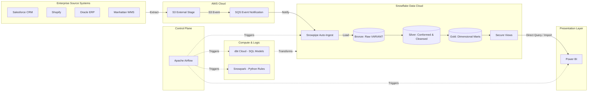
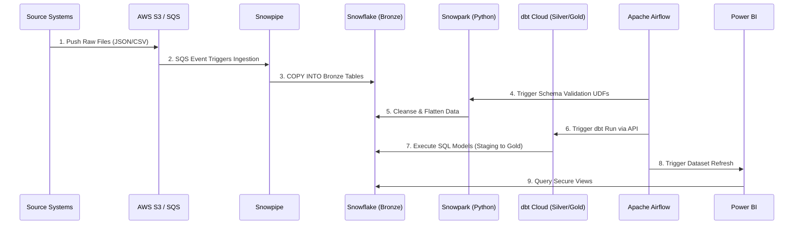

# OmniRetail Group: Enterprise Data Platform High-Level Design (HLD)
**Date:** December 12, 2024
**Phase:** 03 - High Level Design
**Client:** OmniRetail Group 
**Status:** Under Review

---

## 1. Executive Summary
This High-Level Design (HLD) document dictates the target-state architecture for the OmniRetail Group Enterprise Data Platform. The architecture transitions OmniRetail from fragmented, legacy batch processing into a unified, scalable, and highly governed Medallion architecture (Bronze, Silver, Gold). Anchored by Snowflake as the central Data Cloud, dbt Cloud for Analytics Engineering, Snowpark for advanced procedural logic, and orchestrated entirely by Apache Airflow, this design enables near-real-time insights, zero-trust security, and immutable data auditing for 12 distinct enterprise domains.

## 2. Architecture Goals
1. **Unify Enterprise Data:** Establish a single, governed semantic layer for all retail domains.
2. **Minimize Latency:** Shift from 24-hour batch cycles to <15-minute micro-batch CDC processing.
3. **Ensure Zero-Trust Security:** Enforce strict RBAC, Dynamic Data Masking, and Row Access Policies.
4. **Optimize Total Cost of Ownership (TCO):** Implement workload isolation and auto-scaling compute.
5. **Decouple Orchestration:** Establish Airflow as the agnostic control plane.

## 3. Architecture Principles
* **Schema-on-Read at Ingestion, Schema-on-Write at Delivery:** Raw JSON/CSV is landed as VARIANT; schemas are strictly enforced in the Silver/Gold layers.
* **Idempotent Processing:** All data pipelines must be safely restartable without data duplication.
* **Separation of Compute and Storage:** Leveraging Snowflake's native architecture for unbounded scalability.
* **Configuration as Code / Infrastructure as Code:** All infrastructure, roles, and transformations are version-controlled in GitHub.
* **Principle of Least Privilege:** Users only access data through governed views (Gold layer), never raw tables.

## 4. Enterprise Architecture Diagram

## 5. Logical Architecture
The logical architecture is separated into discrete zones:
* **Ingestion Zone:** Captures source system data via automated extracts (Fivetran/Airbyte or direct S3 dumps).
* **Storage Zone (Medallion):** 
  * *Bronze:* Append-only, untransformed JSON/CSV data.
  * *Silver:* Deduplicated, flattened, type-cast, and cleansed entities.
  * *Gold:* Kimball Star Schema (Fact and Dimension tables).
* **Processing Zone:** dbt Cloud (SQL) and Snowpark (Python).
* **Consumption Zone:** Power BI Semantic models querying Snowflake Secure Views.

## 6. Physical Architecture
* **Cloud Provider:** AWS (us-east-1).
* **Storage:** Amazon S3 standard tier for landing zone; Snowflake proprietary micro-partitions for the warehouse.
* **Compute:** Snowflake Virtual Warehouses sized independently (X-Small to L) mapped to specific business functions.
* **Network:** AWS PrivateLink connecting the OmniRetail VPC directly to the Snowflake VPC.

## 7. End-to-End Data Flow
1. Source systems push raw extracts to AWS S3.
2. S3 generates an `ObjectCreated` event, sent to an SQS queue.
3. Snowflake Snowpipe continuously polls the SQS queue.
4. Snowpipe executes `COPY INTO` commands, landing data into Bronze tables.
5. Airflow sensors detect data arrival and trigger Snowpark Python scripts for anomaly detection and JSON flattening.
6. Airflow triggers dbt Cloud Jobs via REST API.
7. dbt executes Staging, Intermediate, and Mart models, loading Silver and Gold tables.
8. Airflow triggers Power BI dataset refreshes.

## 8. AWS Architecture
* **Amazon S3:** Configured with lifecycle policies (transition to Glacier after 30 days) to minimize cost.
* **AWS IAM:** IAM Roles for Snowflake Storage Integration establishing secure, keyless access.
* **Amazon SQS:** Dedicated queues per source system domain for decoupled event routing.

## 9. Snowflake Architecture
* **Storage Integrations:** Abstracting AWS credentials from users.
* **External Stages:** Mapping directly to S3 buckets.
* **Snowpipe:** Continuous, serverless ingestion.
* **Warehouses:** `INGEST_WH`, `SNOWPARK_WH`, `DBT_DEV_WH`, `DBT_PROD_WH`, `BI_REPORTING_WH`.
* **Resource Monitors:** Hard limits enforcing suspension at 100% quota to prevent runaway queries.
* **Time Travel:** Configured for 90 days on Gold tier for accidental drop recovery.

## 10. Airflow Architecture
* **Role:** The singular Enterprise Control Plane.
* **Execution:** Managed Workflows for Apache Airflow (MWAA) on AWS.
* **Integration Pattern:** Airflow DAGs utilize `SnowflakeOperator` for native queries, `DbtCloudRunJobOperator` for dbt triggers, and custom Python operators for API polling.

## 11. dbt Cloud Architecture
* **Project Structure:** Single, monolithic enterprise repository.
* **Environments:** Development, Staging, and Production separated by Snowflake logical databases (`OMNI_DEV`, `OMNI_PROD`).
* **CI/CD:** Slim CI (`state:modified`) utilized during Pull Requests to only build changed models against Zero Copy Clones.
* **Data Quality:** Generic tests (unique, not_null, accepted_values) and singular tests for cross-table validation.

## 12. Snowpark Architecture
Snowpark Python is deployed exclusively for workloads unsuitable for declarative SQL:
* **Schema Validation:** Dynamic inspection of deeply nested Shopify JSON arrays.
* **Data Standardization:** Regex-heavy address normalization across global formats.
* **Business Rules:** Complex, iterative allocation algorithms for inventory distribution.
* **Execution:** Packaged as Python Stored Procedures and User Defined Table Functions (UDTFs).

## 13. Security Architecture
* **Authentication:** Azure AD / Entra ID via SAML 2.0 SSO.
* **Key-Pair Authentication:** Required for service accounts (Airflow, dbt Cloud); no passwords allowed.
* **Dynamic Data Masking:** Applied to PII (Email, Phone, Credit Card). Role `BI_ANALYST` sees `***@***.com`; Role `DATA_STEWARD` sees plaintext.
* **Row Access Policies:** Multi-tenant isolation. A European analyst querying `dim_customer` only sees records where `region = 'EMEA'`.

## 14. Network Architecture
* Snowflake deployed on AWS within the same region as the S3 landing zone to eliminate data egress costs.
* AWS PrivateLink ensures data never traverses the public internet between OmniRetail's AWS VPC and Snowflake's AWS VPC.
* IP Allowlisting applied to all Snowflake network policies.

## 15. Monitoring Architecture
* **Pipeline Monitoring:** Airflow native UI and Datadog integration for DAG failures.
* **Data Observability:** dbt Source Freshness SLAs and `dbt-expectations` test artifacts.
* **Cost Observability:** Snowflake Object Tagging applied to all virtual warehouses and databases, parsed into an executive Cost Dashboard.

## 16. Disaster Recovery Architecture
* **RTO (Recovery Time Objective):** 4 Hours.
* **RPO (Recovery Point Objective):** 15 Minutes (tied to Snowpipe frequency).
* **Strategy:** Snowflake Failover Groups configured for cross-region replication (e.g., US-East to US-West) for critical databases and account metadata.

## 17. Scalability Strategy
* **Compute:** Multi-cluster warehouses enabled on `BI_REPORTING_WH` to automatically scale out concurrently during month-end reporting spikes.
* **Storage:** Snowflake's proprietary storage auto-scales infinitely. High-cardinality tables utilize Automatic Clustering to maintain query pruning efficiency as data grows to the petabyte scale.

## 18. Capacity Planning
* **Storage Estimates:** 50TB Year 1; 120TB Year 2.
* **Compute Estimates:** 
  * Ingestion: Serverless (0.25 credits/hour effective).
  * Transformation (dbt/Snowpark): 1,500 credits/month.
  * Reporting: 2,000 credits/month.
* **Forecasting:** Evaluated monthly via the Operational Monitoring Framework.

## 19. High-Level Deployment Architecture
* GitHub Actions orchestrates deployments.
* `main` branch merges trigger Snowflake DDL application (via schemachange or similar tool) and dbt Cloud production job updates.
* Production deployments are fully automated and gated by mandatory code reviews and Slim CI passes.

## 20. Component Responsibilities
| Component | Responsibility |
| :--- | :--- |
| **AWS S3** | Ephemeral landing zone for raw source files. |
| **Snowflake** | Scalable storage, MPP compute, and data governance enforcement. |
| **dbt Cloud** | SQL transformation logic, documentation, and data quality testing. |
| **Snowpark** | Python-based complex data validation and procedural rules. |
| **Airflow** | DAG orchestration, dependency management, and SLA alerting. |
| **Power BI** | Data visualization and executive dashboarding. |

## 21. Technology Decision Matrix
| Requirement | Selected Tech | Alternative Considered | Rejection Reason |
| :--- | :--- | :--- | :--- |
| **Transformation** | dbt Cloud | Stored Procedures | Lack of version control, testing, and DAG lineage. |
| **CDC Ingestion** | Snowpipe Auto-Ingest | Apache Kafka | Overkill for 15-min SLA; higher operational overhead. |
| **Orchestration** | Apache Airflow | Snowflake Tasks | Airflow handles cross-platform APIs (AWS, dbt, PBI) better. |

## 22. Architecture Risks
1. **Risk:** Unoptimized dbt models scanning massive unclustered fact tables causing credit burn.
   * *Mitigation:* Strict code review for incremental modeling and mandatory clustering keys on large tables.
2. **Risk:** Complex Snowpark Python jobs exhausting warehouse memory.
   * *Mitigation:* Utilizing Snowpark-optimized warehouses for ML/intensive memory tasks.

## 23. Architecture Assumptions
* All source systems can export data to AWS S3 in standard formats (CSV, JSON, Parquet).
* Business stakeholders accept a 15-minute data latency SLA (real-time streaming is not required).

## 24. Constraints
* The platform must adhere strictly to GDPR/CCPA regulations, requiring physical or logical masking of all EU customer data.
* Total Snowflake compute spend must not exceed $15,000/month in Year 1.

## 25. Non-Functional Requirements
* **Availability:** 99.9% uptime for the Gold semantic layer.
* **Security:** 100% of PII data masked at rest and in transit.
* **Maintainability:** All infrastructure and logic codified in Git.

## 26. High-Level Sequence Diagram

## 27. Future Architecture Roadmap
* **Phase 2 (Q4 2025):** Implementation of Snowflake Cortex Analyst for GenAI natural language querying over the Gold layer.
* **Phase 3 (Q1 2026):** Migration of legacy massive-scale historical archives to Apache Iceberg external tables for reduced storage costs while maintaining queryability.
* **Phase 4 (Q2 2026):** Transitioning Shopify ingestion to Snowpipe Streaming for sub-second e-commerce telemetry tracking.
