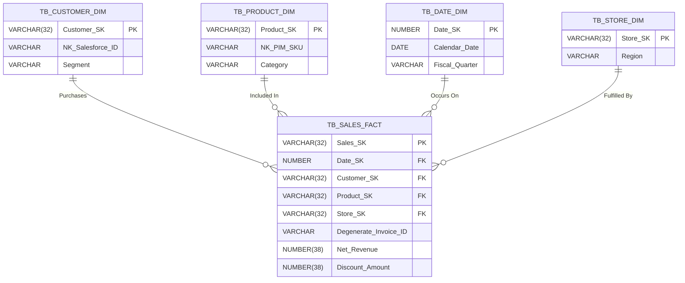
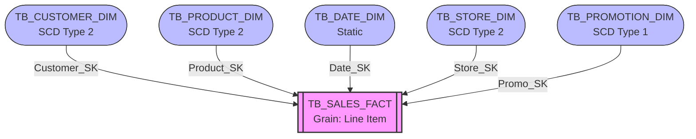

# OmniRetail Group: Enterprise Data Model Document
**Date:** December 16, 2024
**Phase:** 04 - Low Level Design (Data Modeling)
**Client:** OmniRetail Group
**Status:** Under Review

---

## 1. Business Process Matrix
The Business Process Matrix identifies the core retail events OmniRetail must measure, establishing the foundation of our Kimball methodology. 

| Business Process | Source System | Core Event |
| :--- | :--- | :--- |
| **Sales Fulfillment** | Shopify / POS | A product is sold to a customer. |
| **Order Management** | Shopify / Oracle ERP | An order header is created/updated. |
| **Inventory Tracking** | Manhattan WMS | Daily stock levels are recorded per SKU/Store. |
| **Payment Collection** | Stripe | A financial transaction clears or fails. |
| **Returns Processing** | Zendesk / Shopify | A customer initiates a product return. |

## 2. Enterprise Bus Matrix
The Enterprise Bus Matrix defines how conformed dimensions intersect with business processes, ensuring a unified semantic layer (a single version of the truth).

| Business Process (Facts) | Customer | Product | Store | Employee | Supplier | Promotion | Date | Geography | Currency |
| :--- | :--- | :--- | :--- | :--- | :--- | :--- | :--- | :--- | :--- |
| **Sales** | X | X | X | X | | X | X | X | X |
| **Orders** | X | | X | | | | X | X | X |
| **Inventory** | | X | X | | X | | X | X | |
| **Payments** | X | | X | | | | X | X | X |
| **Returns** | X | X | X | X | | | X | X | X |

## 3. Grain Definition for Every Fact Table
Precision in grain definition is critical to prevent double-counting in downstream Power BI reports.
* **`TB_SALES_FACT`:** One row per individual item line on a completed sales invoice.
* **`TB_ORDER_FACT`:** One row per distinct order header (contains totals/summaries, no line items).
* **`TB_INVENTORY_SNAPSHOT_FACT`:** One row per Product SKU, per Store location, per Day at end-of-day.
* **`TB_PAYMENT_FACT`:** One row per distinct payment transaction attempt (success, failure, chargeback).
* **`TB_RETURNS_FACT`:** One row per returned item line associated with a Return Merchandise Authorization (RMA).

## 4. Fact Tables
All fact tables reside in `DB_PROD_ANALYTICS.SC_GOLD_CORE`.
* **`TB_SALES_FACT`:** Captures Gross Merchandise Value (GMV), discount amounts, and net revenue.
* **`TB_ORDER_FACT`:** Captures overarching order metrics (e.g., shipping costs, order status flags).
* **`TB_INVENTORY_SNAPSHOT_FACT`:** Captures Quantity on Hand (QOH), Quantity in Transit, and Reorder Point flags.
* **`TB_PAYMENT_FACT`:** Captures transaction fees, cleared amounts, and gateway latency.
* **`TB_RETURNS_FACT`:** Captures refund amounts, restocking fees, and return reason codes.

## 5. Dimension Tables
All dimensions are conformed and shared across the enterprise Bus Matrix.
* **`TB_CUSTOMER_DIM`:** Consolidated customer profiles from Salesforce and Shopify.
* **`TB_PRODUCT_DIM`:** Master SKU details from PIM.
* **`TB_STORE_DIM`:** Brick-and-mortar and digital storefront entities.
* **`TB_EMPLOYEE_DIM`:** Store associates and customer support agents.
* **`TB_SUPPLIER_DIM`:** Vendor profiles from the Supplier Portal.
* **`TB_PROMOTION_DIM`:** Discount codes, seasonal campaigns from Adobe Marketing.
* **`TB_DATE_DIM`:** Standard calendar mapping to OmniRetail's fiscal periods.
* **`TB_GEOGRAPHY_DIM`:** Standardized global location hierarchies.
* **`TB_CURRENCY_DIM`:** Supported transaction currencies for localized reporting.

## 6. Surrogate Key Strategy
Snowflake does not efficiently support traditional auto-incrementing `IDENTITY` sequences for distributed transformations. We will utilize **MD5 Hashing** of the natural business keys (via the `dbt_utils.generate_surrogate_key` macro).
* *Example:* `MD5(concat(coalesce(cast(shopify_customer_id as varchar), '')))` -> `Customer_SK`
* *Benefits:* Enables idempotent dbt runs, simplifies multi-source key collision management, and operates uniformly in distributed compute.

## 7. Business Key Strategy
Surrogate keys (`*_SK`) are used for all Snowflake joins. However, the original Natural Business Keys (e.g., `Shopify_Order_ID`, `Salesforce_Account_ID`) will always be preserved in the dimension tables as `NK_` prefixed columns to allow analysts to trace records back to the source systems.

## 8. Slowly Changing Dimension (SCD) Strategy
As frozen in the HLD, historical tracking relies on dbt snapshots generating `dbt_valid_from` and `dbt_valid_to` columns.
* **SCD Type 2 (History Tracked):** Customer, Product, Store, Employee.
* **SCD Type 1 (Overwrite):** Currency, Geography, Supplier.
* **Static:** Date.

## 9. Degenerate Dimensions
Data points that act as dimensional attributes but lack a dedicated dimension table will be stored directly on the Fact table. 
* *Examples:* `Order_Number`, `Invoice_ID`, `Transaction_Receipt_Number`. These avoid creating billion-row dimensions that offer no analytical grouping value.

## 10. Junk Dimensions
Low-cardinality flags and indicators will be grouped into consolidated "Junk Dimensions" to prevent fact table bloat.
* **`TB_ORDER_PROFILE_DIM`:** Consolidates `Order_Status` (Pending, Shipped), `Payment_Method` (Credit, PayPal), and `Fulfillment_Type` (Ship-to-Home, BOPIS).

## 11. Bridge Tables
To resolve Many-to-Many relationships without distorting the fact grain, we will utilize Bridge Tables.
* **`TB_SALES_PROMO_BRIDGE`:** Resolves scenarios where a single Sales Line Item is affected by multiple overlapping marketing promotions (e.g., 10% off site-wide + Free Shipping code).

## 12. Hierarchies
Reporting hierarchies will be explicitly flattened into standard columns within dimensions to avoid complex recursive queries in Power BI.
* **Geography:** `Country` -> `Region` -> `State` -> `City` -> `Zip`.
* **Product:** `Department` -> `Category` -> `Sub-Category` -> `Brand` -> `SKU`.

## 13. Cardinality
Snowflake's columnar architecture handles high cardinality naturally. However, extremely high-cardinality dimensions (e.g., `TB_CUSTOMER_DIM` with 50M+ rows) will be monitored. Fact-to-Fact joins are strictly prohibited in the Gold layer; all queries must route through the conformed dimensions.

## 14. Referential Integrity
Snowflake does NOT enforce Foreign Key (FK) constraints during `INSERT/COPY` operations.
* **Strategy:** We will define `CONSTRAINT FOREIGN KEY` in Snowflake purely for the query optimizer (which uses them for join elimination). Actual data integrity will be enforced prior to deployment via dbt generic tests (`relationships`, `not_null`).

## 15. Partitioning Strategy
Unlike Hive/Hadoop, Snowflake does not use static folder partitioning. Data is automatically sharded into 16MB immutable micro-partitions. We will enforce the `ORDER BY` clause in our dbt `MERGE/INSERT` scripts to ensure data lands physically sorted by time, maximizing Snowflake's native metadata pruning.

## 16. Clustering Strategy
Automatic Clustering will be applied exclusively to multi-terabyte fact tables.
* **`TB_SALES_FACT`:** `CLUSTER BY (Date_SK, Store_SK)`. 
* *Justification:* 90% of BI queries filter by Time and Region. Clustering prevents full table scans and minimizes credit burn on the `WH_BI` warehouse.

## 17. Data Distribution
Unlike Amazon Redshift, Snowflake separates compute from storage. There is no concept of `DISTKEY` or broadcast distribution styles. The architecture relies entirely on Snowflake's centralized scalable storage and automatic micro-partition metadata.

## 18. Semantic Layer
The physical `TB_*` tables in `DB_PROD_ANALYTICS` will NOT be exposed directly to end-users. 
* We will deploy a Semantic Layer composed of `VW_SEC_*` (Secure Views) to Power BI.
* These views will rename `*_SK` keys to human-readable names, mask PII via dynamic policies, and enforce Row Access Policies.

## 19. Data Dictionary (Sample)

| Table | Column | Data Type | Constraint | Description |
| :--- | :--- | :--- | :--- | :--- |
| `TB_SALES_FACT` | `Sales_SK` | VARCHAR(32) | PK | MD5 Hash of Source ID. |
| `TB_SALES_FACT` | `Date_SK` | NUMBER | FK | YYYYMMDD integer linked to Date Dim. |
| `TB_SALES_FACT` | `Net_Revenue` | NUMBER(38,4)| None | GMV minus Discounts and Taxes. |
| `TB_CUSTOMER_DIM` | `Email_Hash` | VARCHAR | None | SHA256 hashed email for PII masking. |

## 20. Entity Relationship Diagram (ERD)

## 21. Star Schema Diagram (Sales Focus)

## 22. Future Expansion Strategy
The Star Schema is inherently extensible. 
* **Adding new facts:** When Supply Chain logistics (e.g., shipping delays) are introduced in Phase 2, a new `TB_SHIPPING_FACT` can be created and joined to the existing conformed dimensions (`TB_DATE_DIM`, `TB_STORE_DIM`) without altering existing Sales reporting.
* **Adding new dimensions:** If a new loyalty program is launched, a `TB_LOYALTY_DIM` can be created and a new `Loyalty_SK` column appended to the `TB_SALES_FACT` with a default `-1` (Unknown) for historical records.
