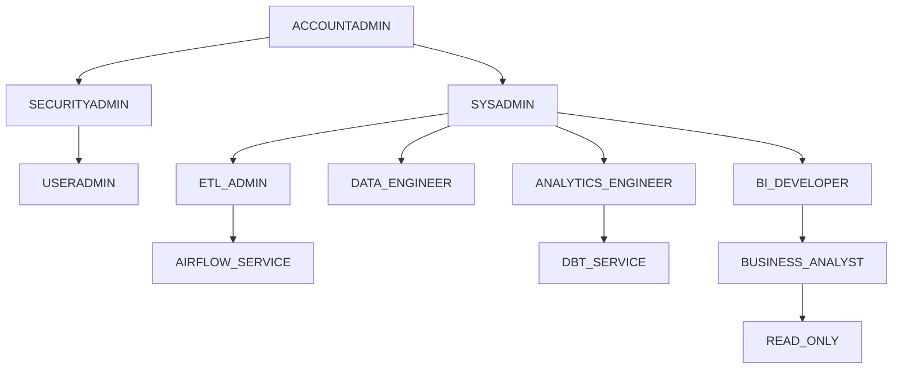

# OmniRetail Group: Enterprise Snowflake Platform Design Document
**Date:** December 14, 2024
**Phase:** 06 - Snowflake Platform Architecture
**Client:** OmniRetail Group
**Status:** Under Review

---

## 1. Snowflake Organization Strategy
To ensure strict isolation between development and production workloads, OmniRetail will utilize Snowflake Organizations (`ORGADMIN`) to manage multiple accounts.

* **Organization:** `OMNIRETAIL_ORG`
* **Accounts:**
  * **PROD:** `OMNIRETAIL_PROD` (Hosts mission-critical pipelines, Gold semantic models, and BI workloads).
  * **QA:** `OMNIRETAIL_QA` (Pre-production UAT environment, synced via Zero Copy Clones).
  * **DEV:** `OMNIRETAIL_DEV` (Developer sandboxes and feature-branch CI/CD testing).
* **Environment Promotion Strategy:** Code is exclusively promoted through GitHub Actions (CI/CD). Developers merge to `main`, which triggers automated DDL application (via schema migration tools) and dbt deployments to QA. Upon UAT sign-off, a manual gate approves deployment to PROD.

---

## 2. Warehouse Strategy
Workload isolation is critical to cost and performance optimization. Warehouses are segmented by functional boundaries to prevent resource contention.

| Warehouse Name | Size | Auto Suspend | Auto Resume | Multi-cluster | Scaling Policy | Resource Monitor | Business Justification |
| :--- | :--- | :--- | :--- | :--- | :--- | :--- | :--- |
| **INGEST_WH** | X-Small | 60 sec | True | 1-1 | Standard | Daily 20 Crd | Handles Snowpipe external stage operations and minor Airflow sensor queries. |
| **TRANSFORM_WH** | Medium | 60 sec | True | 1-2 | Economy | Daily 50 Crd | Executes heavy Snowpark Python data cleansing and flattening logic. |
| **DBT_WH** | Large | 60 sec | True | 1-2 | Standard | Daily 100 Crd | Handles bulk SQL dbt transformations (Bronze -> Silver -> Gold). |
| **BI_WH** | Small | 60 sec | True | 1-5 | Standard | Daily 40 Crd | Services highly concurrent Power BI dashboard queries. Auto-scales horizontally. |
| **ADHOC_WH** | X-Small | 300 sec | True | 1-1 | Standard | Daily 10 Crd | For human Analysts querying via Snowsight. High suspend time prevents query queueing during active sessions. |
| **ADMIN_WH** | X-Small | 60 sec | True | 1-1 | Standard | Daily 5 Crd | Reserved for SYSADMIN / SECURITYADMIN maintenance and DDL execution. |

---

## 3. Database Strategy
The logical separation of data will be governed at the database level to encapsulate environments and platform metadata.

* **RAW:** Landing zone for all untransformed source system data. (Bronze)
* **CURATED:** Standardized, deduplicated, and typed entities. (Silver)
* **ANALYTICS:** Dimensional Kimball Star Schemas serving business logic. (Gold)
* **GOVERNANCE:** Centralized storage for Masking Policies, Row Access Policies, and Tags.
* **METADATA:** Global mapping tables, dbt artifacts, and data dictionary inputs.
* **MONITORING:** Custom views parsing `SNOWFLAKE.ACCOUNT_USAGE` for executive dashboards.
* **REFERENCE:** Static lookups (e.g., ISO Country codes, Zip code mappings).
* **SANDBOX:** Isolated, ephemeral databases allowing Data Scientists to clone PROD data for modeling without impacting core pipelines.

---

## 4. Schema Strategy
Schemas will further organize databases into functional business domains and platform layers.

* **BRONZE:** Target schemas for raw ingestion (e.g., `RAW.BRONZE_SHOPIFY`, `RAW.BRONZE_STRIPE`).
* **SILVER:** Conformed entities (e.g., `CURATED.SILVER_SALES`, `CURATED.SILVER_FINANCE`).
* **GOLD:** Business marts (e.g., `ANALYTICS.GOLD_MARKETING`, `ANALYTICS.GOLD_EXECUTIVE`).
* **AUDIT:** Captures dbt audit trails and DLQ (Dead Letter Queue) quarantine records.
* **LOGGING:** Stored procedure logs and Airflow interaction logs.
* **METADATA:** Data lineage tracking and external API webhook configurations.
* **SECURITY:** PII tokenization mapping tables.
* **REFERENCE:** Static seed data loaded via dbt seeds.
* **UTILITIES:** UDFs and Stored Procedures used globally across the account.

---

## 5. Naming Standards
Strict naming conventions enable automated CI/CD deployments and simplify administrative auditing.

| Object Type | Prefix / Standard | Example |
| :--- | :--- | :--- |
| **Databases** | `DB_<ENVIRONMENT>_<NAME>` | `DB_PROD_ANALYTICS` |
| **Schemas** | `SC_<LAYER>_<DOMAIN>` | `SC_BRONZE_SHOPIFY` |
| **Tables** | `TB_<ENTITY>_<SUFFIX>` | `TB_ORDERS_FACT` |
| **Views (Secure)** | `VW_SEC_<ENTITY>` | `VW_SEC_CUSTOMER_DIM` |
| **Stages** | `STG_<SOURCE>` | `STG_AWS_S3_SHOPIFY` |
| **Pipes** | `PIP_<TARGET_TABLE>` | `PIP_RAW_SHOPIFY_ORDERS` |
| **Streams** | `STR_<SOURCE_TABLE>` | `STR_TB_ORDERS_RAW` |
| **Tasks** | `TSK_<ACTION>` | `TSK_REFRESH_DYNAMIC_TABLE` |
| **Warehouses** | `WH_<FUNCTION>` | `WH_DBT_PROD` |
| **Procedures** | `SP_<ACTION>` | `SP_CLEANSE_ADDRESS` |
| **Functions** | `FN_<ACTION>` | `FN_CALCULATE_LTV` |
| **Policies** | `POL_<TYPE>_<TARGET>` | `POL_MASK_EMAIL` |
| **Tags** | `TAG_<CATEGORY>` | `TAG_COST_CENTER` |

---

## 6. RBAC Design
OmniRetail will implement a strict Role-Based Access Control (RBAC) hierarchy inheriting privileges downwards to system administrators, ensuring the Principle of Least Privilege.

**Privilege Inheritance:** 
No object ownership is granted to users. `SYSADMIN` owns all physical objects. `SECURITYADMIN` owns all roles and policies. Functional roles (e.g., `ANALYTICS_ENGINEER`) are granted to specific Azure AD groups. Service roles (`DBT_SERVICE`) are granted only the precise `USAGE` and `OPERATE` privileges required to execute their specific automated workloads.

---

## 7. Storage Integration Strategy
* **External Stages:** All raw data lands in AWS S3. External stages are configured per source system.
* **Internal Stages:** Utilized exclusively for Snowpark Python package deployments and transient dbt artifacts.
* **File Formats:** Named file formats (e.g., `FMT_JSON_STRIP_OUTER`, `FMT_CSV_SKIP_HEADER`) centrally managed in the `UTILITIES` schema.
* **Storage Integration:** AWS IAM Role-based `STORAGE INTEGRATION` guarantees Snowflake can securely access S3 without passing static AWS Access Keys.
* **S3 Folder Layout:** `s3://omni-datalake-prod/<domain>/<source>/YYYY/MM/DD/`

---

## 8. Governance
* **Dynamic Data Masking (DDM):** Applied to `Email`, `Phone`, `SSN`, and `Credit_Card` columns. Unmasked only for the `DATA_STEWARD` role; dynamically hashed for all others.
* **Row Access Policies (RAP):** Enforced on Gold dimension tables. `BUSINESS_ANALYST_EMEA` can only query rows where `region = 'EMEA'`.
* **Secure Views:** All models exposed to Power BI are materialized as Secure Views, masking underlying DDL and preventing unauthorized lateral traversal.
* **Object Tags:** Applied at the database and warehouse level (`TAG_COST_CENTER = 'MARKETING'`) for precise financial chargebacks.
* **Future Grants:** Configured at the schema level (`GRANT SELECT ON FUTURE TABLES IN SCHEMA...`) to ensure automated CI/CD deployments seamlessly integrate with existing RBAC structures.

---

## 9. Monitoring
Platform monitoring will aggregate Snowflake's native `ACCOUNT_USAGE` schema into an internal `DB_MONITORING` database to feed alerting thresholds.
* **Load History:** Tracking `COPY INTO` successes and failure rates via `LOAD_HISTORY`.
* **Pipeline History:** External Airflow metadata synced into Snowflake for end-to-end tracing.
* **Task/Snowpipe History:** Monitoring queue latency and execution times.
* **Warehouse Usage & Credit Consumption:** Parsing `METERING_HISTORY` against Object Tags for departmental chargebacks.
* **DQ Metrics:** Storing dbt test failures in a dedicated Scorecard table.

---

## 10. Time Travel & Zero Copy Clone Strategy
* **Time Travel:** Configured for standard 1-day retention on Bronze/Silver to optimize storage costs, and 90-day retention on Gold databases to allow for executive audit recovery and historical point-in-time point recovery.
* **Zero Copy Clone (ZCC):** Utilized heavily by dbt Slim CI workflows. CI/CD pipelines will clone the `PROD` database to a transient `CI` database instantaneously, run tests against modified models, and drop the clone, saving immense storage and compute overhead.

---

## 11. Cost Optimization Strategy
* **Aggressive Auto-Suspend:** 60-second suspends on automated workloads (`DBT_WH`, `INGEST_WH`) to prevent idle credit burn.
* **Resource Monitors:** Hard quotas set per warehouse (e.g., 100 credits/day for dbt). Configured to trigger SNS alerts at 80% and suspend immediately at 100%.
* **Transient Tables:** All intermediate dbt models will be materialized as `TRANSIENT` to bypass Fail-safe storage costs.

---

## 12. Performance Optimization Strategy
* **Clustering:** Automatic Clustering Keys implemented on multi-terabyte fact tables (e.g., `TB_SALES_FACT` clustered by `Order_Date` and `Store_ID`) to maximize micro-partition pruning.
* **Micro-partitioning:** Ensured by ordering data effectively during the final dbt `INSERT` / `MERGE` operations.
* **Search Optimization Service (SOS):** Applied selectively to highly-queried Customer dimension tables where analysts frequently search by non-clustered, high-cardinality point-lookup fields (e.g., `Customer_Email`).

---

## 13. Security Strategy
* **Authentication:** Enforced Azure AD SSO. Service accounts (Airflow, dbt) authenticate exclusively via RSA Key-Pair.
* **Network Policies:** Inbound traffic restricted to OmniRetail corporate VPN IPs and dedicated AWS VPC endpoints (AWS PrivateLink).
* **Tri-Secret Secure:** If enterprise compliance dictates, OmniRetail will manage its own AWS KMS encryption keys alongside Snowflake's native keys for ultimate data sovereignty.

---

## 14. Platform Risks
| Risk | Impact | Mitigation Strategy |
| :--- | :--- | :--- |
| **Compute Runaway** | High | Strict Resource Monitors; blocking `ADHOC_WH` from querying unclustered billion-row tables without partition filters. |
| **Role Explosion** | Medium | Prohibiting custom role creation outside of the codified Terraform/GitHub Actions pipeline. |
| **Data Skew** | High | Continuous monitoring of `SYSTEM$CLUSTERING_INFORMATION` to prevent poorly defined clustering keys from degrading query performance. |

---

## 15. Design Decisions (Snowflake ADRs)
1. **Why not Dynamic Tables for everything?** 
   * Dynamic Tables are excellent for continuous pipelines, but dbt Cloud provides superior testing, macros, and git-integrated CI/CD. We reserve Dynamic Tables for specific sub-minute latency views.
2. **Why separate Databases instead of just Schemas?** 
   * Database-level separation ensures Zero Copy Clones can be executed safely for environments (e.g., cloning `DB_PROD` to `DB_QA`) without intermingling production and test schemas.

---

## 16. Deliverables
Following the approval of this Platform Design Document, the execution phase will deliver:
1. **Infrastructure as Code (Terraform / DDL Scripts):** Automating the creation of all Warehouses, Databases, Schemas, and RBAC hierarchies.
2. **Security & Governance Matrix:** Detailed mapping of PII fields to Dynamic Data Masking policies.
3. **Storage Integrations:** Execution of AWS IAM and Snowflake integration configurations.
