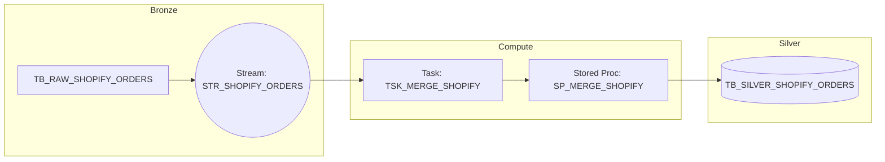

# Module 1: Enterprise CDC Architecture

## 1. Design Summary
This module defines the architectural patterns and operational standards for Change Data Capture (CDC) within the OmniRetail Group Snowflake platform. Our goal is to move beyond fragile, full-table overwrites and establish a highly resilient, incremental, and idempotent data processing framework. This CDC layer is responsible for parsing the raw `VARIANT` payloads in the Bronze tier, standardizing them, and safely merging them into the Silver (`CURATED`) tier.

## 2. Folder Structure
The CDC Framework will be implemented in subsequent modules using the following structure:
```text
08_CDC_Framework/
├── 01_CDC_Architecture.md       # (This Document)
├── src/
│   ├── 01_streams.sql           # Stream definitions on Bronze tables
│   ├── 02_tasks.sql             # Orchestration tasks and scheduling
│   ├── 03_procedures/           # Idempotent MERGE and Error handling stored procedures
│   └── 04_metadata_tables.sql   # CDC watermarks and audit tables
├── tests/
│   └── 01_cdc_validation.sql    # Validation scripts
├── README.md
└── Resume_Mapping.md
```

## 3. CDC Strategy
The CDC framework acts as the connective tissue between the **Bronze** (Raw, Schema-on-Read) and **Silver** (Curated, Relational) layers. We will utilize **Snowflake Streams** on the Bronze tables to automatically capture inserts, updates, and deletes (append-only for raw ingestion) without managing manual timestamp deltas.



### Full Load vs Incremental Load
* **Full Load:** Used exclusively for initial historical seeding or disaster recovery backfills. Accomplished by suspending the CDC task and running a bulk `INSERT OVERWRITE`.
* **Incremental Load (Default):** Driven by Snowflake Streams. The `MERGE` operation will only process the delta (the new/changed records) since the stream's offset was last advanced, drastically reducing `WH_TRANSFORM` compute consumption.

### Watermark Strategy
While Snowflake Streams inherently manage offsets, we implement a secondary **High-Watermark Table** (`TB_META_CDC_WATERMARK`) to track the maximum `ingestion_timestamp` processed per source table. This acts as a fallback for disaster recovery and prevents data loss if a stream is accidentally dropped and recreated.

### Stream Strategy
* **Append-Only Streams:** Since Snowpipe only performs `INSERT` operations into the Bronze layer, our streams will be configured as `APPEND_ONLY = TRUE`. This reduces stream overhead.
* **Stream Advancement:** Streams only advance their offset when consumed by a successful DML transaction. If the `MERGE` fails, the stream does not advance, ensuring zero data loss.

### Task Orchestration
* **Snowflake Tasks:** We will use Snowflake Serverless Tasks (or tasks pinned to `WH_TRANSFORM`) scheduled on a 15-minute cadence.
* **WHEN Condition:** Tasks will utilize `WHEN SYSTEM$STREAM_HAS_DATA('STR_NAME')` to ensure compute is only invoked when data is present, adhering to FinOps best practices.
* **DAG Orchestration:** Later phases (like dbt Cloud) will trigger via Airflow, but the Bronze-to-Silver CDC operates as a self-contained, continuous pipeline within Snowflake.

### MERGE Strategy
All CDC micro-batches are applied to the Silver layer via a `MERGE` statement.
* **Matching Key:** The business primary key (e.g., `Order_ID` from the JSON payload).
* **Update Logic:** We only update if the incoming payload's `updated_at` timestamp is greater than the existing record's timestamp.
* **Insert Logic:** Standard insert for unmatched records.

### Idempotent Processing
The entire CDC process must be idempotent. If Task A fails halfway and is retried, or if duplicate payloads arrive from the source (e.g., Shopify sends the same order twice), the `MERGE` statement ensures the Silver table state remains perfectly consistent. Deduplication is handled dynamically during the `MERGE` by utilizing a `QUALIFY ROW_NUMBER() OVER (...) = 1` window function on the incoming stream data.

### Late Arriving Data Handling
Because the `MERGE` statement relies on the source system's natural `updated_at` timestamp, a payload that arrives 3 days late will still be processed accurately. If a newer record has already been processed (due to out-of-order delivery), the late-arriving (but older) record will be ignored by the `MERGE` condition (`incoming.updated_at > existing.updated_at`).

### Delete Handling
If source systems send explicit "delete" payloads (e.g., `{"order_id": 123, "status": "deleted"}`):
* We perform **Soft Deletes**. We update an `is_deleted = TRUE` flag and `deleted_at` timestamp in the Silver layer rather than issuing a physical `DELETE`. This preserves history for compliance and dimensional modeling.

### Replay Strategy
If corrupted data contaminates the Silver layer, we execute a Replay:
1. Identify the corrupt timeframe in the Bronze layer.
2. Recreate the Stream with `AT (TIMESTAMP => ...)` to rewind the offset to the point before corruption.
3. Trigger the Task. The idempotent `MERGE` will automatically overwrite the corrupted Silver records with the correct payloads.

### Error Handling & Quarantine Strategy
If a payload cannot be parsed (e.g., a critical JSON path changes and breaks the type casting), the Stored Procedure will trap the error using a `TRY...CATCH` block. 
* The failing transaction is rolled back (the stream does not advance).
* The bad record is isolated and moved to `DB_PROD_RAW.SC_BRONZE_QUARANTINE.TB_DLQ_CDC`.
* The CDC process continues processing the remaining healthy records.

### Audit Strategy & Metadata Tables
Every execution of the CDC task writes to `DB_PROD_METADATA.SC_META_PIPELINE.TB_CDC_EXECUTION_LOG`:
* `Execution_ID`, `Target_Table`, `Rows_Inserted`, `Rows_Updated`, `Status`, `Duration_MS`
This provides strict auditability for data compliance and SLA reporting.

### Monitoring Approach
Airflow (or Datadog via Snowflake integration) will query `TB_CDC_EXECUTION_LOG`. If `Status = 'FAILED'` or if `SYSTEM$STREAM_HAS_DATA` remains true for more than 4 hours without a successful run (indicating a blocked stream), an automatic PagerDuty alert will be fired to the Data Engineering team.

---

*End of Module 1. Awaiting approval to proceed to Module 2 (Implementation).*
