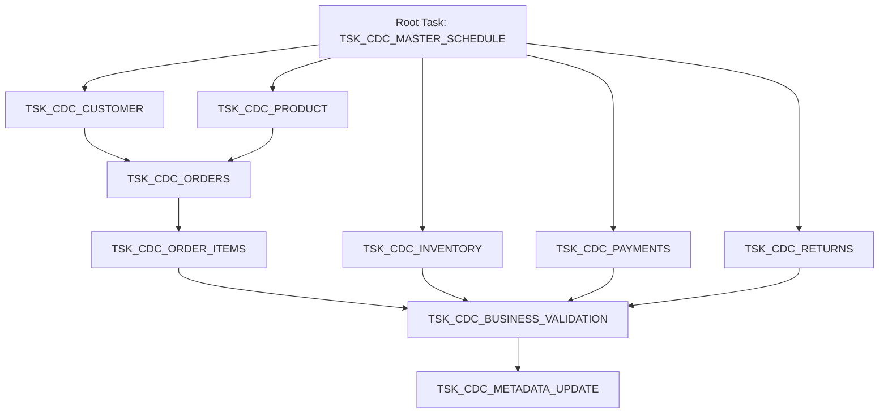

# Module 3: Enterprise Tasks Architecture

## Task Architecture & Dependency Graph
In Snowflake, a DAG (Directed Acyclic Graph) of tasks allows us to orchestrate dependencies natively without relying on external schedulers like Airflow for the micro-batch CDC layer.

Our CDC Task Graph is triggered every 15 minutes by a single Root Task. The child tasks execute in parallel (where possible) and feed into a final consolidated metadata update task.

## Scheduling Strategy

1. **Near Real-Time (1-5 minutes):** 
   * *Not Selected for General CDC.* While possible, 1-minute scheduling significantly increases Cloud Services compute costs and leads to tiny micro-partitions that require expensive background clustering.
   * *Exception:* Only utilized for specific operational tables (e.g., POS Inventory ticks) if required.
2. **Micro-Batch (15 minutes):** 
   * **Selected Cadence.** This provides the optimal balance between SLA latency and warehouse cost efficiency. By batching 15 minutes of data, the subsequent `MERGE` operations are highly performant and generate well-sized micro-partitions in the Silver layer.
3. **Hourly / Daily / Weekly:** 
   * Used for downstream dbt Cloud materializations (Phase 10), but too slow for the initial Bronze-to-Silver CDC layer.

## Warehouse Strategy

* **Root Task (`TSK_CDC_MASTER_SCHEDULE`):** `SERVERLESS` compute. The root task simply triggers the DAG and does no heavy lifting. Serverless is ideal here.
* **Child CDC Tasks (`TSK_CDC_ORDERS`, etc.):** `WH_TRANSFORM` (Size: MEDIUM). 
   * *Business Justification:* The CDC child tasks perform the heavy `MERGE` statements. These require dedicated compute. Because the DAG executes the child tasks concurrently, `WH_TRANSFORM` will parallelize the threads. If the DAG expands significantly, we can configure `WH_TRANSFORM` as a Multi-Cluster Warehouse to handle the concurrency burst.
* **Validation & Metadata Tasks:** `SERVERLESS` compute. These tasks execute lightweight inserts into audit tables and benefit from the zero-maintenance serverless model.

## Task Naming Standards
* `TSK_<DOMAIN>_<ACTION>`
* Example: `TSK_CDC_ORDERS`, `TSK_CDC_METADATA_UPDATE`
