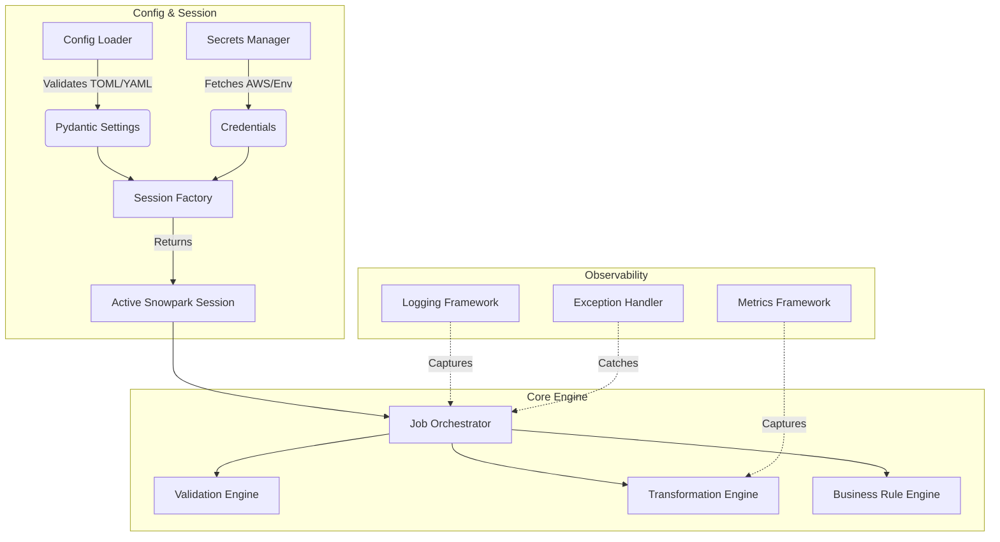
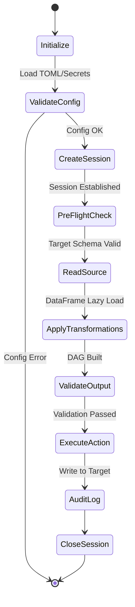

# Enterprise Snowpark Framework Architecture

**Phase 09 – Module 1**  
**Role:** Principal Snowflake Architect & Python Engineer  

---

## 1. Design Summary

The OmniRetail Data Platform requires a scalable, maintainable, and highly governed execution framework for advanced transformations, machine learning feature engineering, and complex business rules that surpass the practical limits of declarative SQL. 

### Why Snowpark?
- **Push-Down Compute:** Snowpark allows Python code to execute directly on Snowflake's compute clusters. Data never leaves Snowflake, eliminating network egress costs and massive security/governance risks.
- **Lazy Evaluation:** Snowpark DataFrame operations build a directed acyclic graph (DAG) of operations which are compiled into highly optimized Snowflake SQL before execution.
- **Ecosystem Integration:** Secure integration with enterprise Python packages (via Anaconda integration) allows the use of Pandas, Scikit-learn, and custom business logic within the warehouse.

### Why Python inside Snowflake?
- **Skillset Convergence:** Enables Data Engineers, Data Scientists, and Analytics Engineers to collaborate in a unified language ecosystem.
- **Complex Logic:** Procedural loops, dynamic JSON traversing, fuzzy matching, and API-like parameterization are fundamentally easier to build and test in Python than in SQL Stored Procedures.

### When Snowpark is preferred over SQL
- **Dynamic DataFrame Operations:** Pivoting dynamic columns, applying functions across 100+ columns iteratively.
- **Data Science Workloads:** Feature engineering, model inference (UDFs).
- **Procedural Orchestration:** Highly parameterized pipelines requiring complex validation, branching logic, and error handling before executing queries.

### Framework Objectives
- **Modularity:** Separate configuration, session management, business rules, and transformations.
- **Resilience:** Automatic retry mechanisms, session pooling, and graceful degradation.
- **Testability:** 100% unit test coverage via Pytest, utilizing mocked Snowflake sessions.
- **Governance:** Strict secrets management and immutable logging.

---

## 2. Framework Architecture

The framework is designed as a set of loosely coupled Python modules.

### Component Details
1. **Configuration Management:** Uses `pydantic-settings` and TOML to enforce type safety on environment variables.
2. **Session Management:** A Factory pattern that handles connection lifecycle, leveraging the `tenacity` library for exponential backoff retries.
3. **Logging Framework:** JSON-formatted stdout logging for DataDog/CloudWatch ingestion, coupled with a Snowflake Table Logger for audibility.
4. **Exception Handling:** Custom exception hierarchy (`SnowparkConnectionError`, `DataValidationError`, `TransformationError`).
5. **Validation Engine:** Pre-execution and post-execution DataFrame validation (e.g., checking null thresholds, schema enforcement).
6. **Transformation Engine:** Reusable pure functions that accept a Snowpark DataFrame and return a mutated DataFrame.
7. **Business Rule Engine:** Domain-specific logic separated from generic transformations.

---

## 3. Snowpark Application Lifecycle

Every Snowpark Job within this framework follows a strict state machine:

---

## 4. Enterprise Strategies

### Configuration Strategy
- **File Format:** TOML (`dev.toml`, `qa.toml`, `prod.toml`).
- **Hierarchy:** Environment Variables > TOML File > Default Values.
- **Validation:** Pydantic is used to strictly enforce types (e.g., ensuring `timeout_ms` is an integer).

### Secrets Strategy
- **No Hardcoding:** Credentials are NEVER committed to source control.
- **Local Dev:** Handled via `.env` files parsed by `python-dotenv`.
- **Production:** Handled via AWS Secrets Manager (fetched via `boto3`) or injected directly by the orchestration tool (e.g., MWAA / Airflow).

### Logging & Exception Strategy
- **Standardized Format:** All logs emit a standardized JSON payload including `job_id`, `pipeline_name`, `timestamp`, and `log_level`.
- **Fail Fast:** If pre-flight validation fails, the job raises a custom `PreFlightError` and exits gracefully before consuming Snowflake compute.
- **Safe Retries:** Connection drops raise a `SnowparkConnectionError` which triggers a maximum of 3 retries with exponential backoff.

### Security Strategy
- **Role Isolation:** Sessions are strictly instantiated with the least-privileged role defined in the environment configuration.
- **Object Permissions:** Snowpark never uses `ACCOUNTADMIN`. It operates as `DATA_ENGINEER` or `DATA_SCIENTIST` roles.

### Unit Testing Strategy
- **Local Execution:** Pytest runs without a live Snowflake connection using the `snowflake-snowpark-python` local testing framework or `patch`/`Mock` for session objects.
- **Transformation Tests:** DataFrame transformations are tested by asserting the expected query plan or executing against a local Pandas fallback where appropriate.

### Deployment Strategy
1. Code pushed to Git.
2. CI/CD pipeline runs `pytest`, `flake8`, `black`, and `mypy`.
3. Application is packaged into a Zip file or Docker image.
4. Deployed as a Snowpark Stored Procedure (via `snowcli`) OR deployed to AWS MWAA/ECS as an external client application.
