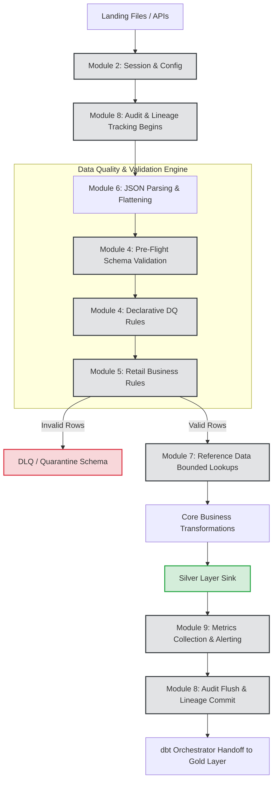

# Enterprise End-to-End Snowpark Pipeline
## Module 10 - Design Summary

### Integration Strategy
This final module represents the culmination of the entire Enterprise Snowpark Framework (Modules 1-9). The `PipelineOrchestrator` acts as the master conductor. Instead of Data Engineers rewriting logging, validation, and metadata logic for every new dataset, they simply instantiate the `PipelineOrchestrator`, inject the business logic closures, and the framework automatically guarantees SLA compliance, DLQ routing, and immutable auditing.

### End-to-End Execution Flow (Architecture)

### Handoff to dbt (Gold Layer)
Snowpark is unparalleled for parsing complex JSON, enforcing dynamic data quality, and scaling Python-based ML models in the Silver layer. However, for dimensional modeling (Star Schema) and aggregations in the Gold Layer, declarative SQL via `dbt` remains the industry standard. The Snowpark orchestrator flushes its metadata to the Control Table, signaling external tools (like Airflow) to trigger the downstream dbt execution, maintaining perfect modularity.
