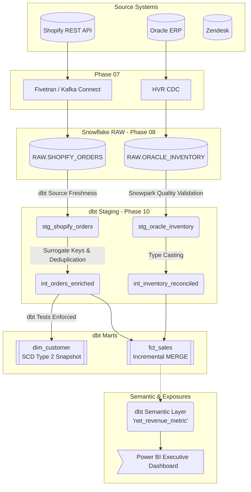

# Enterprise Architecture Overview

This document illustrates the complete end-to-end architecture of the OmniRetail Enterprise Data Platform, bridging raw data ingestion to executive analytics.

## Complete Data Lineage



## Complete Repository Structure
The dbt project is structured following enterprise best practices:
```text
10_dbt_Project/
├── analyses/              # Ad-hoc analytical queries
├── catalog/               # Business glossary and semantic metrics
├── docs/                  # Architectural decision records (ADRs)
├── exposures/             # Downstream consumer mappings
├── governance/            # Data contracts and ownership matrices
├── lineage/               # Lineage diagrams
├── macros/                # Reusable Jinja functions (utilities, audit, dates)
├── models/
│   ├── staging/           # 1:1 view of raw sources with standardized naming
│   ├── intermediate/      # Business logic, joining, surrogate key generation
│   ├── marts/
│   │   ├── dimensions/    # Conformed Kimball dimensions
│   │   └── facts/         # Granular transactional facts
│   └── incremental/       # Highly optimized delta models (MERGE / INSERT_OVERWRITE)
├── seeds/                 # Static reference data (e.g., currency_codes.csv)
├── snapshots/             # SCD Type 2 automated historical tracking
├── tests/
│   ├── generic/           # Reusable parameter-driven test macros
│   └── singular/          # Complex multi-table SQL assertions
├── dbt_project.yml        # Core configuration and materialization strategy
└── packages.yml           # Dependencies (dbt_utils, dbt_expectations)
```
