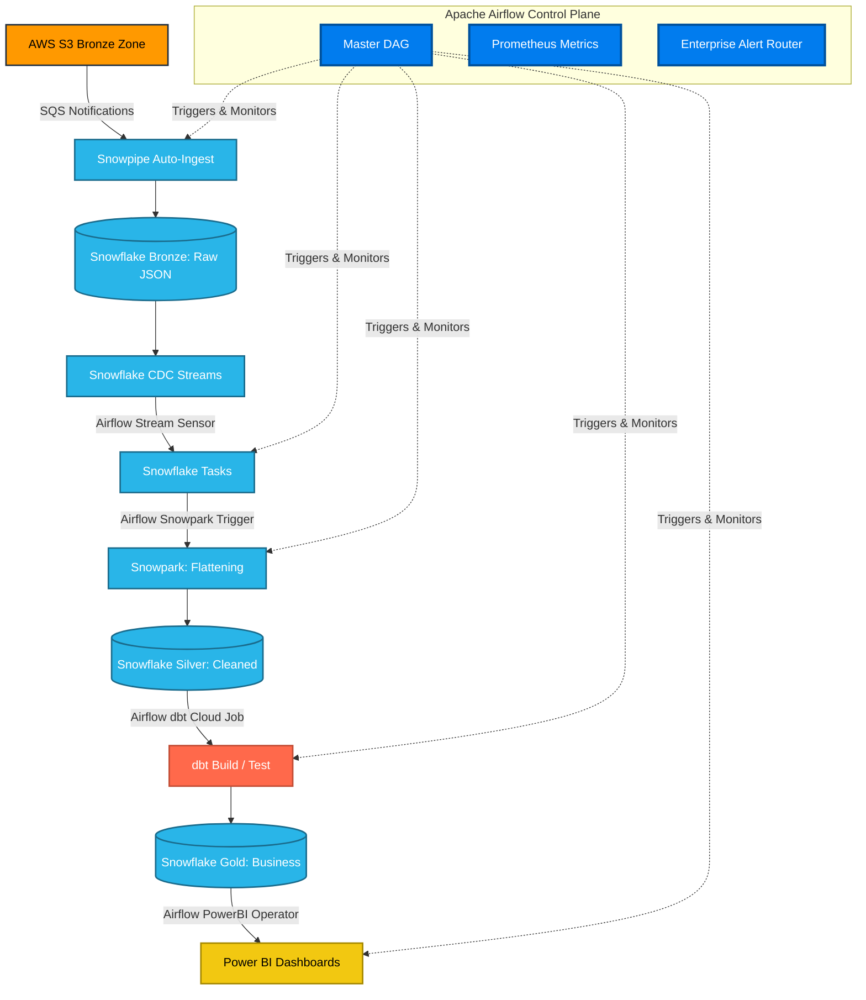

# Capstone Module: Enterprise Architecture Overview

The following diagram illustrates the complete, end-to-end Enterprise Data Platform architecture we have built across all 11 phases of this project. Apache Airflow acts as the central "Brain" (Control Plane), coordinating compute (Muscle) across AWS, Snowflake, Snowpark, and dbt Cloud.

### Strategic Separation of Concerns
1. **No Data Processing in Airflow:** Notice that Airflow handles zero rows of data. It issues commands (SQL, API calls) and listens for success. 
2. **Compute Localization:** Snowpark processes data natively inside Snowflake (no egress). dbt Cloud compiles SQL and pushes it to Snowflake.
3. **Resilience:** If Snowflake crashes, the Airflow `EnterpriseSnowflakeOperator` automatically catches the failure and routes it through the `EnterpriseAlertRouter` to PagerDuty.
