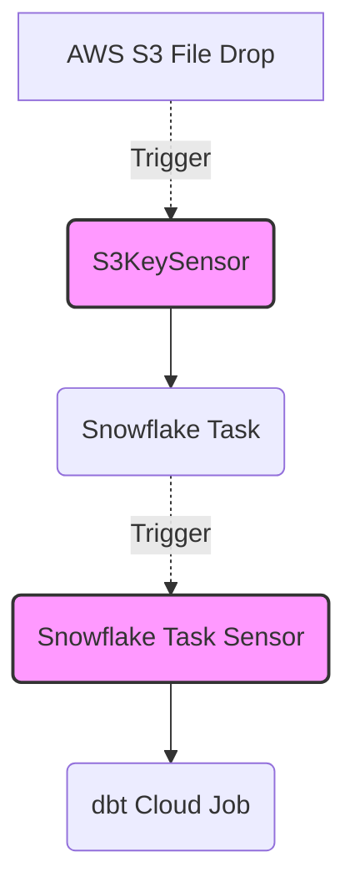

# Enterprise Sensors & Event-Driven Pipelines
## Module 05 - Design Summary

### Why Event-Driven Pipelines?
Traditional data platforms rely on hardcoded schedules (e.g., "Run ingestion at 2:00 AM, run dbt at 3:00 AM"). If ingestion takes 90 minutes, the dbt job fails. If ingestion finishes in 5 minutes, the dbt job waits 55 minutes doing nothing.
Event-driven orchestration solves this. Instead of arbitrary time gaps, tasks execute *immediately* when their dependencies are met.

### Sensors vs. Scheduled Jobs
A **Sensor** is a special type of Airflow Operator that waits for a condition to be met (e.g., an S3 file dropping, or a Snowflake Stream populating). By placing a Sensor at the beginning of a DAG, we turn a Scheduled pipeline into an Event-Driven pipeline.

### Sensor Performance (Poke vs. Reschedule)
This is the most critical design decision in Airflow architecture:
- **`mode = 'poke'` (Anti-pattern for long waits):** The Airflow worker sleeps but *keeps the execution slot occupied*. If 5 sensors are poking, 5 worker slots are blocked. This causes severe bottlenecks and "Zombie" starvation.
- **`mode = 'reschedule'` (Enterprise Standard):** The sensor checks the condition. If false, it completely releases the Airflow worker back to the pool, schedules itself to run again in X minutes, and shuts down. This allows infinite sensors to run simultaneously without locking up the cluster.

### Event-Driven Lineage

