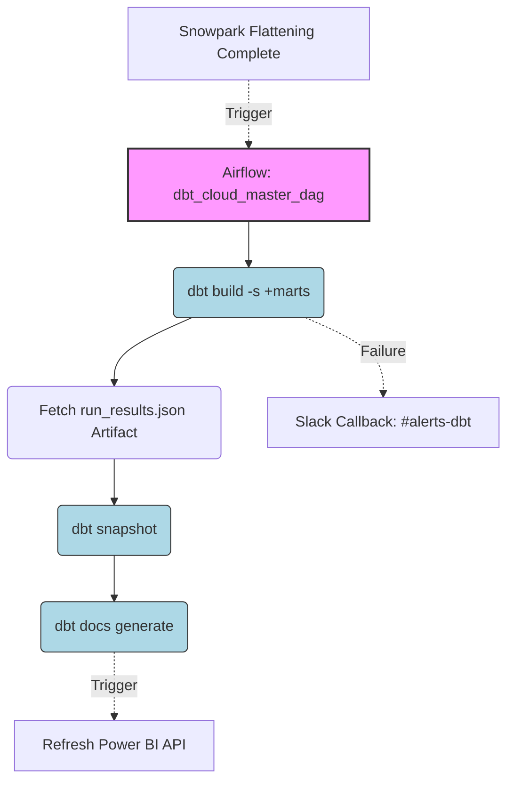

# Enterprise dbt Cloud Integration
## Module 06 - Design Summary

### Why Airflow orchestrates dbt Cloud
It is a common question: *"If dbt Cloud has a built-in scheduler, why are we using Airflow to trigger it?"*
At an Enterprise level, dbt Cloud cannot see outside of its own ecosystem. If Fivetran ingestion fails, or a Snowpark Python job crashes, the dbt Cloud scheduler will blindly run at 3:00 AM anyway, compiling stale or broken data into the Gold Layer. 
By disabling the dbt Cloud scheduler and using Airflow as the "Control Plane," we guarantee that dbt *only* executes when all upstream dependencies (Fivetran, Snowpipe, Snowpark) have successfully completed.

### REST API Integration Strategy
The `DbtCloudRunJobOperator` utilizes the dbt Cloud REST API v2. 
- It issues a `POST /jobs/{job_id}/run/` command to trigger the job.
- It then polls `GET /runs/{run_id}/` every 60 seconds (or delegates to the Triggerer in `deferrable` mode) until the status returns `10` (Success) or `20` (Error).

### Advanced Workflow Lineage

