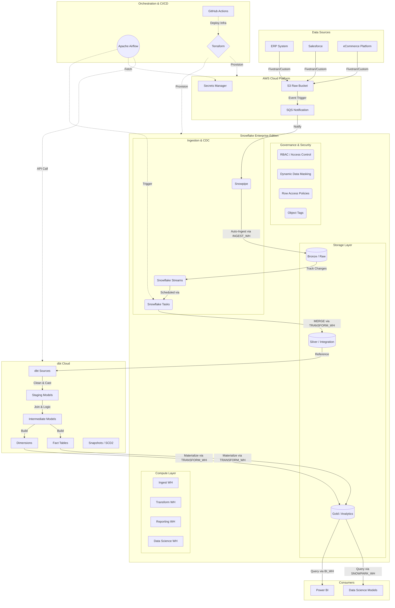

# Complete Enterprise Architecture

## 1. End-to-End Mermaid Architecture



---

## 2. Platform Capabilities Summary

| Capability | Technology | Description |
|------------|------------|-------------|
| **Cloud Storage** | AWS S3 | Highly durable object storage for raw data landing and Terraform remote state. |
| **Data Warehouse** | Snowflake | Multi-cluster, shared data architecture. Handles all storage and compute for Data Engineering, Analytics, and Data Science. |
| **Data Transformation** | dbt Cloud | Version-controlled, test-driven SQL transformation framework (T-ELT) managing the Silver-to-Gold progression. |
| **Advanced Processing** | Snowpark (Python) | Serverless execution of complex Python logic (JSON parsing, ML feature engineering) directly adjacent to Snowflake data. |
| **Orchestration** | Apache Airflow | The "Brain" of the platform. Manages dependencies across systems (Snowflake, dbt, AWS) via DAGs. Strictly a control plane (no data processing). |
| **Infrastructure as Code** | Terraform | Defines all AWS resources and foundational Snowflake architecture (Warehouses, Databases, Network Policies). |
| **CI/CD** | GitHub Actions | Automates testing and deployment of Terraform, Airflow DAGs, and Snowflake DDL. Uses AWS OIDC for passwordless authentication. |
| **Security & Gov.** | Snowflake | Granular RBAC, Row Access Policies, Dynamic Data Masking for PII, and Network Policies enforcing Zero-Trust access. |
| **Monitoring** | Operations Center | Unified dashboard aggregating Snowflake `ACCOUNT_USAGE`, Airflow stats, and dbt Cloud API metrics into a single pane of glass. |
| **FinOps** | Snowflake | Workload isolation via dedicated virtual warehouses, enforced credit budgets via Resource Monitors, and query optimization. |
| **Disaster Recovery** | Snowflake Time Travel | Near-zero RPO with up to 90 days of Time Travel for data recovery, plus Zero-Copy Clones for instant QA environment provisioning. |

---

## 3. Complete Enterprise Repository Structure

```text
Project_snowflake_live/
├── 01_Project_Overview/
├── 02_Solution_Design_Document/
├── 03_High_Level_Design/
├── 04_Enterprise_Data_Model/
├── 05_AWS_Infrastructure/         (Terraform modules for S3, IAM, Secrets)
├── 06_Snowflake_Platform/         (Foundational DDL for DBs, Warehouses)
├── 07_Enterprise_Security/        (RBAC, Masking, Row Access Policies)
├── 08_CDC_Framework/              (Snowpipe, Streams, Tasks, MERGE logic)
├── 09_Snowpark_Framework/         (Python UDFs/UDTFs, Feature Engineering)
├── 10_dbt_Project/                (dbt models, tests, snapshots, macros)
├── 11_Airflow_Orchestration/      (DAGs, Custom Operators, Alert Routing)
└── 12_Platform_Engineering/
    ├── terraform/                 (Consolidated IaC)
    ├── ci_cd/                     (GitHub Actions OIDC workflows)
    ├── secrets_management/        (AWS KMS & Secrets Manager)
    ├── security/                  (Advanced Governance, Network Policies)
    ├── cost_optimization/         (FinOps, Sizing, Query Tuning case studies)
    ├── observability/             (Data Quality, Platform Health, Incident Mgmt)
    ├── disaster_recovery/         (Time Travel, Drills, RTO/RPO mapping)
    ├── operations/                (SOPs, Runbooks, Maintenance schedules)
    └── handover/                  (Executive Capstone Deliverables)
```
