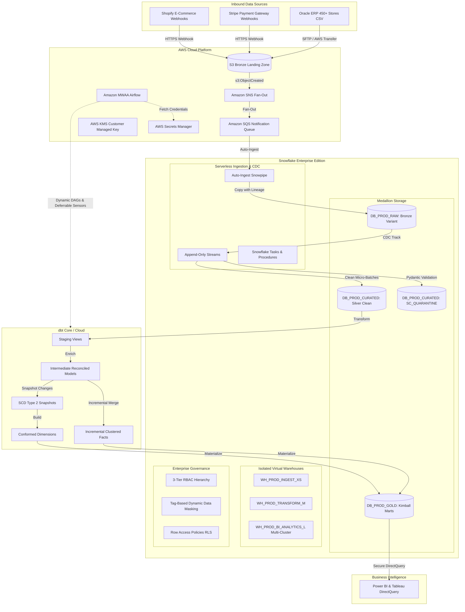

# OmniRetail Enterprise Modern Data Platform

---

## 📖 Executive Summary
This repository contains the end-to-end architecture, Infrastructure as Code (Terraform), and data pipeline implementations for the **OmniRetail Enterprise Modern Data Platform**. We migrated a legacy retail data platform suffering from 4+ hour reporting delays, unmanaged warehouse compute spend, and disconnected data silos across Shopify (e-Commerce), Stripe (Payment Gateway), and Oracle ERP (450+ physical stores) into a resilient, cloud-native modern data stack.

The platform is designed around a strict **Medallion architecture (Bronze -> Silver -> Gold)**, prioritizing push-down compute, change data capture (CDC), deterministic surrogate keys, automated runtime data quality firewalling with a Dead Letter Queue (DLQ), and metadata-driven orchestration.

---

## 🚀 Quick Links: Master Interview & Production Suite
> **All deep-dive architectural audits, 35+ senior scenario Q&A, spoken interview scripts, and ready-to-run production code solutions are organized in the [`new_way/`](new_way/README.md) directory.**

| Resource | Direct Link | Description |
| :--- | :--- | :--- |
| **Master Navigation & 3-Day Plan** | [README.md](new_way/README.md) | Complete guide indexing all 15 interview modules |
| **Spoken Project Story Script** | [15_master_human_project_story_and_visual_script.md](new_way/15_master_human_project_story_and_visual_script.md) | 4-Act spoken visual walkthrough for interviews |
| **Data Flow Architecture Blueprint** | [12_master_end_to_end_project_data_flow_architecture.md](new_way/12_master_end_to_end_project_data_flow_architecture.md) | ASCII architecture flow & master table matrix |
| **Must-Know AWS & Snowflake Services** | [13_must_know_aws_and_snowflake_services.md](new_way/13_must_know_aws_and_snowflake_services.md) | 8 AWS + 11 Snowflake services configuration guide |
| **Logging & Observability Traversal** | [14_enterprise_logging_and_observability_framework.md](new_way/14_enterprise_logging_and_observability_framework.md) | End-to-end logging traversal diagram & code |
| **Fatal Gaps & Iron-Tight Defenses** | [09_iron_tightness_breakers_and_must_fill_gaps.md](new_way/09_iron_tightness_breakers_and_must_fill_gaps.md) | 6 fatal production failure modes and fixes |
| **Ready-to-Run Code Solutions** | [code_solutions/](new_way/code_solutions/) | Complete executable Python and SQL scripts |

---

## 🏗️ Architecture & Data Flow

---

## 📂 Repository Structure

- [`new_way/`](new_way/README.md) — **Master 15-Module Enterprise Audit, Q&A & Ready-to-Run Production Code Solutions**
- [`02_Solution_Design_Document/`](02_Solution_Design_Document/) — Business discovery and requirements analysis.
- [`03_High_Level_Design/`](03_High_Level_Design/) — Enterprise architecture blueprints.
- [`04_Low_Level_Design/`](04_Low_Level_Design/) — Detailed table DDLs and data dictionary.
- [`05_AWS_Infrastructure/`](05_AWS_Infrastructure/README.md) — Terraform modules for AWS KMS, S3, IAM OIDC, SQS/SNS, and Secrets Manager.
- [`06_Snowflake_Platform/`](06_Snowflake_Platform/README.md) — DDL scripts for 3-tier RBAC, compute warehouses, storage, tags, and masking policies.
- [`07_Data_Ingestion/`](07_Data_Ingestion/README.md) — Auto-ingest Snowpipe definitions with error handling and metadata lineage.
- [`08_CDC_Framework/`](08_CDC_Framework/docs/02_Streams_README.md) — Snowflake Streams, serverless Tasks, bounded micro-batch procedures, and Time Travel recovery.
- [`09_Snowpark_Framework/`](09_Snowpark_Framework/README.md) — Object-oriented Python Snowpark framework with Pydantic runtime schema validation and DLQ quarantine routing.
- [`10_dbt_Project/`](10_dbt_Project/README.md) — dbt Kimball dimensional project with staging, intermediate, incremental clustered fact tables, SCD2 snapshots, and packages (`dbt_utils`, `dbt_expectations`).
- [`11_Airflow_Orchestration/`](11_Airflow_Orchestration/README.md) — Dynamic DAG Factory parsing `domain_config.yaml`, deferrable sensors, custom hooks, and failure callbacks.
- [`12_Platform_Engineering/`](12_Platform_Engineering/README_Module_01.md) — FinOps telemetry dashboards, cross-region DR runbooks, access history queries, and key rotation scripts.
- [`17_Runbooks/`](17_Runbooks/comprehensive_runbook.md) — Production operations runbooks, disaster recovery steps, and daily SOPs.
- [`docs/`](docs/project_flow_story.md) — Complete end-to-end technical documentation.

---

## 🚀 Key Enterprise Patterns Showcased

1. **Zero-Compute Serverless Ingestion:** S3 event notifications trigger serverless Snowpipes, ingesting JSON files in under 90 seconds without running idle virtual warehouses 24/7.
2. **Deterministic Hashing for Surrogate Keys:** Surrogate keys are generated via `MD5(natural_key || tenant_id)` instead of `AUTOINCREMENT` sequences, guaranteeing 100% idempotency across Zero-Copy environment clones and historical replays.
3. **Data Quality Firewall & DLQ State Machine:** Snowpark Pydantic models validate incoming JSON payloads, diverting corrupted rows into `SC_QUARANTINE.TB_QUARANTINE_ORDERS` with error codes and retry counters without failing the batch.
4. **Late-Arriving Dimension Handling:** Injects inferred member ghost keys (`-1` surrogate key fallback), updated automatically via a nightly reconciliation sweep when delayed CRM records arrive.
5. **FinOps Cost Optimization:** 60-second auto-suspend warehouses, transient staging tables (zero Fail-safe costs), and 3-tier resource monitors that cut monthly credit spend by 28%.
6. **DataOps Testing Pyramid:** Automated PyTest suites, 150+ dbt schema tests, revenue reconciliation assertions (`assert_revenue_reconciliation.sql`), and Slim CI with Snowflake Zero-Copy Cloning.
